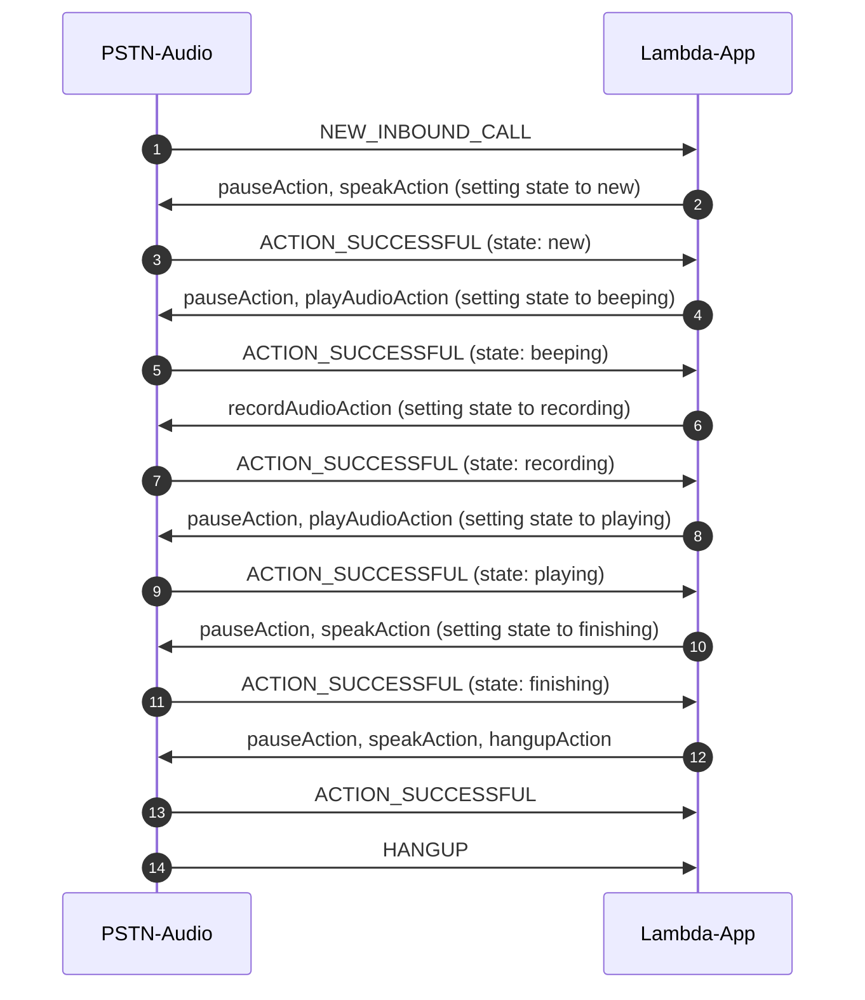

# Example 5: Call and Make Recording

[Previous Lesson](../call-lex-bot/README.md)  
[Next Lesson](../../README.md)  

## Overall Behavior

The application will answer the phone, use Amazon Polly to read a prompt, play a tone, then record a message.  It then uses Polly to say a message and then plays the recorded message, then says goodbye and hangs up.

## Operation

This lambda is invoked when a call arrives at your provisioned phone number.  Like the earlier examples, the starting point is NEW_INBOUND_CALL.  However, this example adds in recording a message and leverages the [TransactionAttributes](https://github.com/aws-samples/amazon-chime-sdk-pstn-audio-workshop/tree/main/docs/how-it-works#lambda-transactionattributes) feature to track the state of the call.

The call will progress through the following states:

* new
* beeping
* recording
* playing
* finishing

We set the "state" by using TransactionAttributes.  These enable lambda developers to store application-specific information in the SMA and transparently passed in the event object of every subsequent invocation for that session.  A session is for the lifetime of that call (inbound or outbound). This feature removes the need for customers to store this type of information in an external database like DynamoDB.  These attributes are covered in detail in the [How it Works](https://github.com/aws-samples/amazon-chime-sdk-pstn-audio-workshop/tree/main/docs/how-it-works#lambda-transactionattributes) document.  

State is set and evaluated where we process the ACTION_SUCCESSFUL events:

```typescript
   case "ACTION_SUCCESSFUL":
      console.log("ACTION_SUCCESSFUL");
      if (event.CallDetails.TransactionAttributes.state == "new") {
        response.TransactionAttributes = { "state": "beeping" };
        response.Actions = beepCall(event);
      }
      if (event.CallDetails.TransactionAttributes.state == "beeping") {
        response.TransactionAttributes = { "state": "recording" };
        response.Actions = recordCall(event);
      }
      if (event.CallDetails.TransactionAttributes.state == "recording") {
        response.TransactionAttributes = { "state": "playing" };
        response.Actions = playbackRecording(event);
      }
      if (event.CallDetails.TransactionAttributes.state == "playing") {
        response.TransactionAttributes = { "state": "finishing" };
        response.Actions = endCall(event);
      }
      break;
```      

In a production application we would need to put error recovery handling similar to this, to allow us to return to a state and repeat following an error.  That is omitted in this example for brevity.

## Recordings

This example records callers and stores those recording in S3.  When you delete the deployment stack using "yarn destroy" (see the [instructions](../../README.md#cleanup)). 

## Call Sequence Diagram




## Try It!

Assuming you have already deployed the parent directory and provisioned Amazon Chime SDK PSTN resources, you can deploy this lambda and test it like this:

```bash
yarn deploy
yarn swap
```

As we learned in the [CDK Overview](../../docs/cdk-overview/) "yarn deploy" will do a CDK deploy of the lambda and "yarn swap" will do an "aws chime update-sip-media-application" command to set this lambda as the one that will be invoked when a call arrives.

You can see the CloudWatch log group using the command

```bash
yarn group
```

You can remind yourself of your PSTN Audio phone number with

```bash
yarn number
```

## Provisioning Notes

The parent project deploys the S3 bucket for this example.  When you destroy the parent stack (see the [instructions](../../README.md#cleanup)) the S3 bucket will be destroyed and all the recordings will be deleted.  This happens because we set the removalPolicy to DESTROY and the autoDeleteObjects to true:

```typescript
 // create a bucket for the recorded wave files and set the right policies
    const wavFiles = new s3.Bucket(this, 'wavFiles', {
      publicReadAccess: false,
      autoDeleteObjects: true,
      removalPolicy: RemovalPolicy.DESTROY,
    });
```    

If your application needs to preserve recordings, you can change these settings.  Please be aware that chaning these settings will incur costs for storage of the recordings.

You can get more information on the CDK deployment scripts in the [How It Works](../../docs/how-it-works/) section.

[Previous Lesson](../call-lex-bot/README.md)  
[Next Lesson](../../README.md)  
