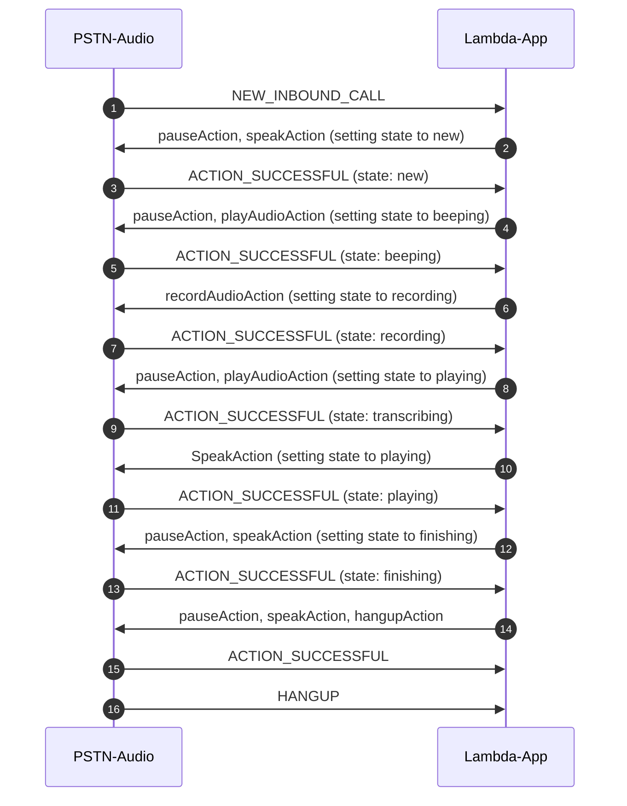

# Example 5: Call and Transcribe Recording

[Previous Lesson](../call-make-recording/README.md)  
[Next Lesson](../../README.md)  

## Overall Behavior

The application will answer the phone, use Amazon Polly to read a prompt, play a tone, then record a message.  It then sends the recording to Amazon Transcribe.  The results are stored on S3.  It then reads the transcription back to the caller using Amazon Polly, then says goodbye and hangs up.

## Operation

This lambda is invoked when a call arrives at your provisioned phone number.  Like the earlier examples, the starting point is NEW_INBOUND_CALL.  Like the prvious example this code records a message and leverages the [TransactionAttributes](https://github.com/aws-samples/amazon-chime-sdk-pstn-audio-workshop/tree/main/docs/how-it-works#lambda-transactionattributes) feature to track the state of the call.  However, once the recording is made it sends a command to Amazon Transcribe with the location of the recording. The transcription will be placed back in the same bucket.  

Like the last example the code makes use of TransactionAttributes to cache call state.  Every time an action succeeds the state is advanced.  Here is the relevant code:

```typescript
  case "ACTION_SUCCESSFUL":
      console.log("ACTION_SUCCESSFUL");
      if (event.CallDetails.TransactionAttributes.state == "new") {
        response.TransactionAttributes = { "state": "beeping" };
        response.Actions = beepCall(event);
      }
      if (event.CallDetails.TransactionAttributes.state == "beeping") {
        response.TransactionAttributes = { "state": "recording" };
        response.Actions = recordCall(event);
      }
      if (event.CallDetails.TransactionAttributes.state == "recording") {
        response.TransactionAttributes = { "state": "transcribing", "params": transcribeParams };
        response.Actions = await transcribeRecording(event);
      }
      if (event.CallDetails.TransactionAttributes.state == "transcribing") {
        response.TransactionAttributes = { "state": "playing" };
        response.Actions = await playbackRecording(event);
      }
      if (event.CallDetails.TransactionAttributes.state == "playing") {
        response.TransactionAttributes = { "state": "finishing" };
        response.Actions = endCall(event);
      }
      break;
```

In a production application we would need to put error recovery handling similar to this, to allow us to return to a state and repeat following an error.  That is omitted in this example for brevity.

To begin the transcription, the code declares the filename of the recording and filename of the output.  It uses the same bucket for both.  It uses the callid as a semi-unique key.

```typescript
async function transcribeRecording(event: any) {
  const s3Uri = "s3://" + event.ActionData.RecordingDestination.BucketName + "/" + event.ActionData.RecordingDestination.Key;
  transcribeParams.TranscriptionJobName = event.CallDetails.Participants[0].CallId;
  transcribeParams.Media.MediaFileUri = s3Uri;
  if (wavFileBucket) {
    transcribeParams.OutputBucketName = wavFileBucket;
  }
  transcribeParams.OutputKey = event.CallDetails.Participants[0].CallId + "/" + event.CallDetails.Participants[0].CallId + ".json";
  console.log("transcribing media at: ", s3Uri);
  try {
    const command = new StartTranscriptionJobCommand(transcribeParams);
    console.log("command:", command);
    const data = await transcribeClient.send(command);
    console.log("Success - put", data);
  } catch (err) {
    console.log("Error", err);
  }
  speakAction.Parameters.Text = "<speak>Transcribing recording, please wait.  This may take up to fifteen seconds.</speak>";
  return [speakAction];
}
```

Now is the tricky part.  We set a default error message for Amazon Polly to read in case the transcription does not succeed.  In production code we would add a lot more error handling in this function.  We enter a loop and we wait for the transcription to be complete.  In production code we would probably set up a second lambda, or an EventBridge or S3 event to trigger when the transcription is done instead of busy waiting.  At scale, waiting these seconds would add up, increasing your bill.  Setting a trigger would be more cost effective.  When the transcription is complete we need to get the json file from S3.  We then read the transcription back using Amazon Polly.

```typescript
async function playbackRecording(event: any) {
  const params = event.CallDetails.TransactionAttributes.params;
  console.log("params:", params);
  var loop = true;
  var status;

  speakAction.Parameters.Text = "<speak>Sorry, we encountered an error transcribing your message</speak>"

  while (loop) {
    status = await getTransaction(event);
    switch (status) {
      case null:
        loop = false;
        console.log("Error: no response object for transcription");
        break;
      case CallAnalyticsJobStatus.COMPLETED:
        console.log("COMPLETED");
        loop = false;
        const result = await downloadFromS3(params);
        var jsonResult: TranscribeResult;
        jsonResult = JSON.parse(result as string);
        const transcript = jsonResult.results.transcripts[0].transcript;
        speakAction.Parameters.Text = "<speak>Your message says, " + transcript + " </speak>";
        break;
      case CallAnalyticsJobStatus.FAILED:
        console.log("FAILED");
        loop = false;
        break;
      case CallAnalyticsJobStatus.IN_PROGRESS:
      case CallAnalyticsJobStatus.QUEUED:
        loop = true; // wait for completion
        await new Promise(r => setTimeout(r, 500));
        break;
    }
  }
  return [speakAction];
}
```

We are using the AWS SDK for Javascript v3, which uses a stream interface instead of a direct file read interface.  This requires us to read the entire stream, like this:

```typescript
async function downloadFromS3(params: any) {
  const client = new S3Client({});
  const command = new GetObjectCommand({ Bucket: params.OutputBucketName, Key: params.OutputKey });
  console.log("bucket:", params.OutputBucketName);
  console.log("key:   ", params.OutputKey);

  const streamToString = (stream: any) => {
    return new Promise((resolve, reject) => {
      const chunks: any = [];
      stream.on("data", (chunk: any) => chunks.push(chunk));
      stream.on("error", reject);
      stream.on("end", () => resolve(Buffer.concat(chunks).toString("utf-8")));
    });
  };
  try {
    const response = await client.send(command);
    const body = await streamToString(response.Body);
    return body;
  } catch (err) {
    console.log("Error", err);
  }
  return "";
}
```

## Recordings

This example records callers and stores those recordings and transcriptions in S3.  When you delete the deployment stack using "yarn destroy" (see the [instructions](../../README.md#cleanup)). 

## Call Sequence Diagram




## Try It!

Assuming you have already deployed the parent directory and provisioned Amazon Chime SDK PSTN resources, you can deploy this lambda and test it like this:

```bash
yarn deploy
yarn swap
```

As we learned in the [CDK Overview](../../docs/cdk-overview/) "yarn deploy" will do a CDK deploy of the lambda and "yarn swap" will do an "aws chime update-sip-media-application" command to set this lambda as the one that will be invoked when a call arrives.

You can see the CloudWatch log group using the command

```bash
yarn group
```

You can remind yourself of your PSTN Audio phone number with

```bash
yarn number
```

## Provisioning Notes

The parent project deploys the S3 bucket for this example.  When you destroy the parent stack (see the [instructions](../../README.md#cleanup)) the S3 bucket will be destroyed and all the recordings will be deleted.  This happens because we set the removalPolicy to DESTROY and the autoDeleteObjects to true:

```typescript
 // create a bucket for the recorded wave files and set the right policies
    const wavFiles = new s3.Bucket(this, 'wavFiles', {
      publicReadAccess: false,
      autoDeleteObjects: true,
      removalPolicy: RemovalPolicy.DESTROY,
    });
```    

If your application needs to preserve recordings, you can change these settings.  Please be aware that chaning these settings will incur costs for storage of the recordings.

You can get more information on the CDK deployment scripts in the [How It Works](../../docs/how-it-works/) section.


[Previous Lesson](../call-make-recording/README.md)  
[Next Lesson](../../README.md)  
